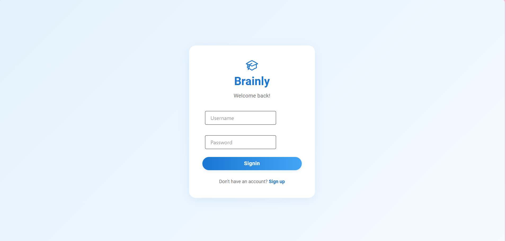
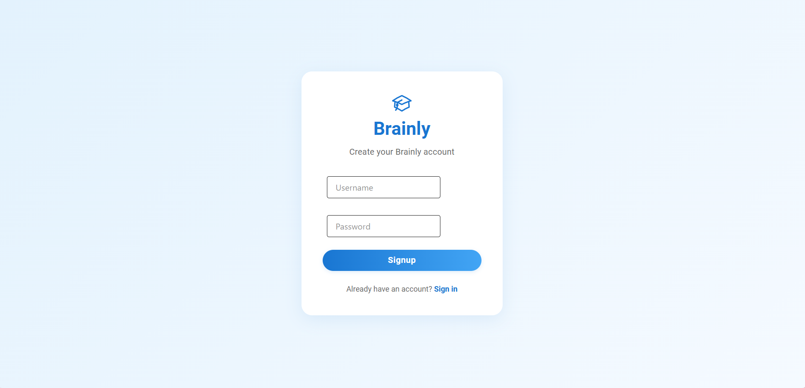
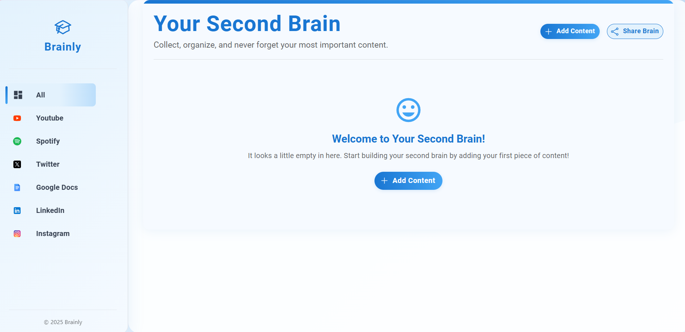
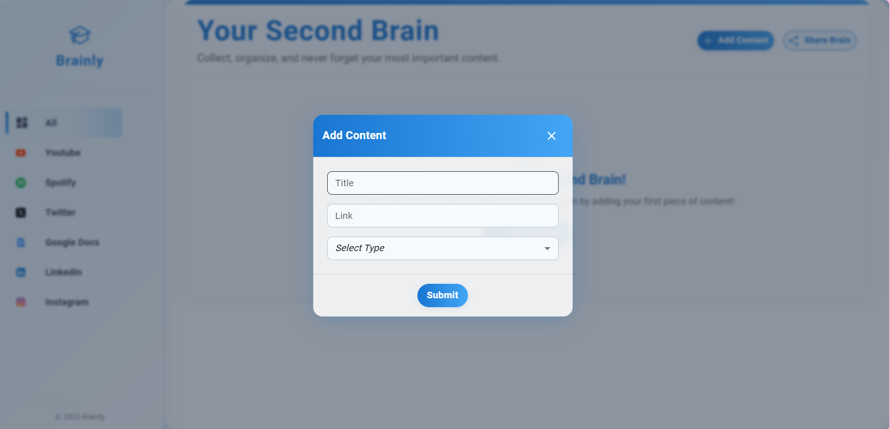

# Brainly Frontend

A modern React-based frontend application for managing and organizing content from various social media platforms and productivity tools.

## 🚀 Features

- **User Authentication**: Secure signup and signin functionality
- **Content Management**: Add, view, and delete content from multiple platforms
- **Platform Integration**: Support for Twitter, YouTube, Google Docs, Instagram, LinkedIn, and Spotify
- **Modern UI**: Beautiful Material-UI design with responsive layout
- **Real-time Updates**: Dynamic content refresh and state management

## 🛠️ Tech Stack

- **React 19** - Modern React with hooks
- **TypeScript** - Type-safe development
- **Material-UI (MUI)** - Beautiful UI components
- **Tailwind CSS** - Utility-first CSS framework
- **React Router** - Client-side routing
- **Axios** - HTTP client for API calls
- **Vite** - Fast build tool and dev server

## 📦 Installation

1. **Clone the repository**
   ```bash
   git clone <repository-url>
   cd brainly_frontend
   ```

2. **Install dependencies**
   ```bash
   npm install
   ```

3. **Start development server**
   ```bash
   npm run dev
   ```

4. **Open your browser**
   Navigate to `http://localhost:5173`

## 🏗️ Project Structure

```
src/
├── components/          # Reusable UI components
│   ├── Button.tsx
│   ├── Card.tsx
│   ├── ContentModal.tsx
│   ├── Input.tsx
│   ├── Sidebar.tsx
│   └── SidebarItem.tsx
├── pages/              # Page components
│   ├── dashboard.tsx
│   ├── Signin.tsx
│   └── Signup.tsx
├── hooks/              # Custom React hooks
│   └── UseContent.tsx
├── icons/              # SVG icons
│   ├── Logo.tsx
│   ├── PlusIcon.tsx
│   └── ...
└── config.ts           # Configuration constants
```

## 🎯 Key Features

### Authentication
- User registration and login
- JWT token-based authentication
- Secure password handling

### Dashboard
- Content organization by platform
- Add new content with platform selection
- Delete content with confirmation
- Responsive sidebar navigation

### Content Management
- Support for multiple platforms:
  - Twitter
  - YouTube
  - Google Docs
  - Instagram
  - LinkedIn
  - Spotify

## 📱 Screenshots

### Sign In Page


### Sign Up Page


### Dashboard


### Content Modal


## 🚀 Available Scripts

- `npm run dev` - Start development server
- `npm run build` - Build for production
- `npm run lint` - Run ESLint
- `npm run preview` - Preview production build

## 🔧 Configuration

The application connects to a backend API. Update the `BACKEND_URL` in `src/config.ts` to point to your backend server.

## 🤝 Contributing

1. Fork the repository
2. Create a feature branch
3. Make your changes
4. Submit a pull request

## 📄 License

This project is licensed under the MIT License.

---

**Note**: This frontend requires a backend server to function properly. Make sure the backend is running and accessible.
